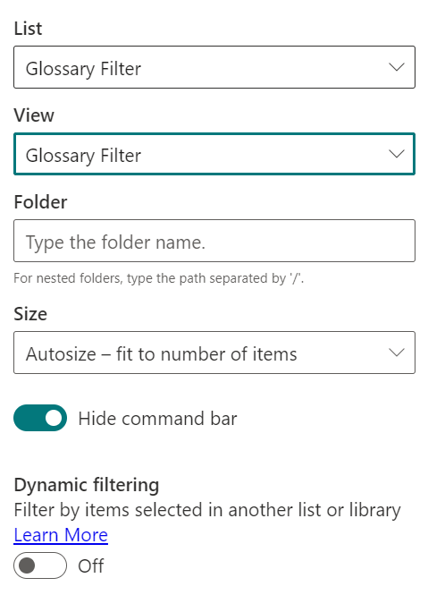
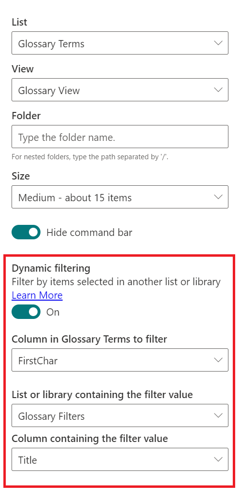

# Glossary View Formatter - To be used in connected list WebParts

## Summary
View formatters to buid a glossary page using connected list WebParts. 

Two lists are needed to use this sample, so two separate JSON files are used:

File Name|Details
---------|--------
[glossary-filter.json](./glossary-filter.json)|Used to format the filter list. 
[glossary-view.json](./glossary-view.json)|Used to format the main list.

## View requirements

List 1: Glossary Filter

Type|Internal Name|Required|Details
-----|----------|--------|--------
Single line of text|Title|Yes|Used to store a character to be used as a filter

In this list we need to store all the alphabet letters from A to Z (or your country language variation of the alphabet if preferred) to be used later as filters.
Apply the [glossary-filter.json](./glossary-filter.json) view formatter in a view in this list.

---
List 2: Glossary Terms
This is the list used to store all terms and descriptions. This list will consist of 3 fields:

Type|Internal Name|Required|Details
-----|----------|--------|--------
Single line of text|Title|Yes|Used to store the glossary term
Multiple lines of text| Description|Yes|Used to store the term description, no rich text enabled)
Calculated|FirstChar| |Used too show the first character of the term. This will be the key for the whole functionality). Set it to use an output of 'Single line of text' and use as the formula: =LEFT(Title,1).This will extract only the first character from the Title field and use it as the value. 

Apply the [glossary-view.json](./glossary-view.json) view formatter in a view in this list.

## Setting up the glossary page

Create a new blank page under your site and add a single column section.
On this section, add a first List WebPart for the Glossary Filter list and use the following settings for the WebPart (hide the command bar so only the view content is shown):

Add another list WebPart below it, but now select the Glossary Terms list, with the following settings (remember to hide the command bar so only the custom view will be shown):

Rename the webparts as desired, save and publish your page to get the correct settings applied. 

In the example shown above, they were renamed from:

-Glossary Terms to Terms

-Glossary Filters to Glossary

## Sample

Solution|Author(s)
--------|---------
glossary-filter.json |  [Michel Mendes](https://twitter.com/michelcarlo)
glossary-view.json | [Michel Mendes](https://twitter.com/michelcarlo) - Tweaked FAQ template from [Chris Kent](https://twitter.com/theChrisKent)

## Version history

Version|Date|Comments
-------|----|--------
1.0|April 04, 2021|Initial release

## Disclaimer
**THIS CODE IS PROVIDED *AS IS* WITHOUT WARRANTY OF ANY KIND, EITHER EXPRESS OR IMPLIED, INCLUDING ANY IMPLIED WARRANTIES OF FITNESS FOR A PARTICULAR PURPOSE, MERCHANTABILITY, OR NON-INFRINGEMENT.**

---

## Additional notes
Any potential additional notes to get included in the readme around the sample with additional pictures etc.

References:
Glossary content was built using Microsoft Terminology Collection:
https://www.microsoft.com/en-us/language/Terminology

JSON for Glossary view was adapted from the FAQ Sample from PnP GitHub Samples:
https://github.com/pnp/sp-dev-list-formatting/tree/master/view-samples/faq-format

